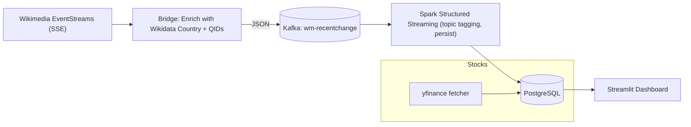

# Wikimedia–Stock Market Correlation Platform

**Team:** Christopher Chellakudam, Benedikt Fritzenwallner, Mine Sungur  
**Course:** Data Engineering  
**Date:** November 2025  

---

## Abstract / Executive Summary

We built a real-time data pipeline that links **Wikimedia edit activity** to **stock market movements** to study whether public attention correlates with price action. Live Wikipedia edits are enriched with **country** and **topic** metadata via Wikidata, streamed through **Kafka**, classified and persisted by **Spark Structured Streaming** into **PostgreSQL**, and visualized in **Streamlit** alongside **yfinance** OHLCV data.  

The result is a robust, reproducible, and observable streaming architecture that turns collective online behavior into **geo-aware market indicators**.

---

## Problem Statement

**Users:** data scientists, traders/analysts, journalists, policymakers, data engineers.  
**Pain point:** It’s hard to quantify how real-time information attention (e.g., edit spikes on sensitive topics) relates to market behavior per country.

### User Stories

- As a **data scientist**, I want to analyze live Wikipedia edits enriched with country and topic metadata so that I can quantify how attention and controversies correlate with stock movements.
- As a **trader**, I want to see surges in topics like “war”, “economics”, and “energy” so that I can anticipate potential market-moving events.
- As a **journalist**, I want to track pages with rapid edit growth so that I can discover emerging stories and verify attention dynamics.
- As a **policymaker**, I want aggregated edits by country/topic so that I can assess geopolitical/economic risks earlier.
- As a **data engineer**, I want a reliable pipeline (Wikimedia → Kafka → Spark → Postgres → Streamlit) so that the system is scalable, observable, and maintainable.

---

## System Architecture and Design

### High-Level Architecture


## How it helps

- **Country-first enrichment** ensures geo-aware analytics.  
- **Keyword-topic tagging** enables domain filtering (finance, politics, war, etc.).  
- **Minute OHLCV and country-average returns** enable alignment with edit intensity.  
- **Streamlit** provides rapid iteration and analyst-friendly visualizations.  

---

## Data Sources

- **Wikimedia EventStreams (SSE):** public JSON stream of live edits (high-velocity, real-time).  
- **Wikidata APIs:** JSON lookups for entity relationships (country via `P17` or `P131` chains; ISO via `P297`).  
- **Yahoo Finance (yfinance):** polled OHLCV (1m+ intervals) → Pandas DataFrames → Postgres.  
- **PostgreSQL:** durable storage for edits (`wm_recent_change`), topics (`wm_topic`), tickers (`ticker`), and minute bars (`stock_value_1m`).  

**Velocity & Volume (approx):**  
- **Edits:** continuous stream (hundreds/second globally; filtered to Wikipedia namespace, country-resolved only).  
- **Stocks:** minute-level polling per selected tickers; stored as 1m OHLCV.  

---

## Data Model

### Core tables (PostgreSQL)

- `wm_topic(key, label, enabled, keywords[])` — topic dictionary.  
- `wm_recent_change(...)` — enriched edits (country, topics[], timestamps, metadata).  
- `ticker(id, symbol, name, exchange, currency, mic, tz, iso2)` — instrument catalog (mapped to country).  
- `stock_value_1m(ticker_id, ts_utc, interval='1m', open, high, low, close, volume, ...)` — minute OHLCV.  

### Views

- `v_wm_recent_change_enabled` — country-resolved, topic-matched rows only.  
- `v_symbol_return_1m` — per-symbol minute returns.  
- `v_country_return_minute` — average minute returns per country.  

### Relationships

- `wm_recent_change.page_country_code ↔ country_dim.iso2`  
- `ticker.iso2 ↔ country_dim.iso2`  
- `stock_value_1m.ticker_id ↔ ticker.id`  

---

## Setup and Deployment

### Prerequisites

- **Docker 25+** and **Docker Compose 2.20+**  
- **Internet access** (Wikimedia SSE, Wikidata, Yahoo Finance)  
- Optional local tools: **psql**, **Python 3.11+** for debugging  

## Installation & Launch

### Clone the repository
```bash
git clone https://github.com/ai25m043/DEMAI_WS25.git
cd DEMAI_WS25
```
```
docker-compose up --build -d
```

## Services (defaults)

| Service | URL | Description |
|----------|-----|-------------|
| **Streamlit Dashboard** | [http://localhost:8501](http://localhost:8501) | Interactive visualization UI |
| **Kafka UI** | [http://localhost:8081](http://localhost:8081) | Inspect Kafka topics and messages |
| **Spark UI** | [http://localhost:4040](http://localhost:4040) | Monitor Spark Structured Streaming |
| **PostgreSQL** | `localhost:5432` | Credentials: `postgres / postgres`, Database: `demai` |

---

## Configuration Parameters

You can override these via environment variables or directly in `docker-compose.yml`.

| Variable | Default | Used By | Description |
|-----------|----------|---------|-------------|
| `POSTGRES_DB` | `demai` | Postgres | Database name |
| `POSTGRES_USER` | `postgres` | Postgres | DB user |
| `POSTGRES_PASSWORD` | `postgres` | Postgres | DB password |
| `KAFKA_BOOTSTRAP` | `wm-kafka:9092` | Bridge / Spark | Kafka bootstrap server |
| `KAFKA_TOPIC` | `wm-recentchange` | Bridge / Spark | Topic for enriched edits |
| `STARTING_OFFSETS` | `earliest` | Spark | Initial offsets (earliest/latest) |
| `PROBE_CONSOLE` | `true` | Spark | Optional console probe of raw JSON |
| `PG_HOST` | `wm-postgres` | Spark / Fetcher / Streamlit | DB host (container network) |
| `PG_PORT` | `5432` | Spark / Fetcher / Streamlit | DB port |
| `PG_DB` / `PGDATABASE` | `demai` | Spark / Fetcher / Streamlit | DB name |
| `PG_USER` / `PGUSER` | `postgres` | Spark / Fetcher / Streamlit | DB user |
| `PG_PASS` / `PGPASSWORD` | `postgres` | Spark / Fetcher / Streamlit | DB password |
| `YF_INTERVALS` | `1m,5m,1h,1d` | Stock fetcher | Intervals to fetch |
| `FETCH_CYCLE_SECS` | `60` | Stock fetcher | Polling frequency (seconds) |
| `REFRESH_SECS` | `30` | Streamlit | Auto-refresh cadence |

---

## Limitations and Future Work

### Limitations

- Country resolution depends on **Wikidata completeness** (ambiguous entities can reduce accuracy).  
- **yfinance** polling is subject to API rate limits and may miss pre/post-market data.  
- Correlation is **exploratory** (no lag modeling or causality yet).  
- **Streamlit** refresh is periodic (not real-time push updates).  
### Future Work

- Add **sentiment analysis** of Wikipedia edit comments and talk pages.  
- Model **lagged/lead relationships** using ML or time-series forecasting.  
- Implement **real-time streaming joins** between edit events and stock returns.  
- Integrate **alerting and notification systems** (WebSockets, SSE, or email).  
- Deploy the pipeline on **Kubernetes** for scalability and observability (Prometheus/Grafana).  

## Conclusion

This project demonstrates a complete, containerized **data engineering pipeline** that connects real-time public information flows (Wikipedia edits) with stock market data.  
By combining **Kafka**, **Spark Structured Streaming**, **PostgreSQL**, and **Streamlit**, it transforms open data into actionable geo-economic insights.  
The system proves that attention-based signals can be quantified and correlated with financial movements, providing a foundation for predictive research and future market intelligence tools.
